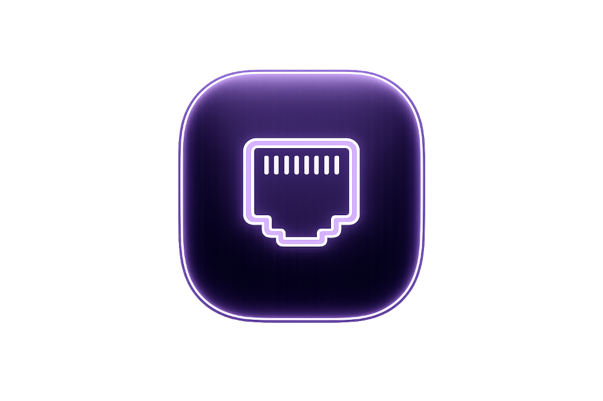
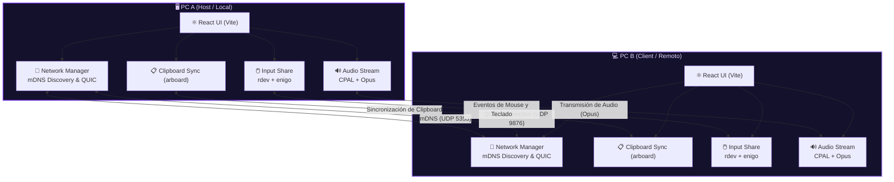

<div align="center">



# 🌉 NetBridge

### **Conexión Total · Control Fluido · Compartición sin Fronteras**
*One Keyboard, One Mouse, One Clipboard — for all your PCs.*

---

[](LICENSE)
[](https://tauri.app)
[](https://www.rust-lang.org)
[](https://react.dev)
[](https://www.typescriptlang.org)

[](https://www.microsoft.com/windows)
[](https://kernel.org)
[](https://github.com/ChronosXCore/pc-conector)

---

**🌐 [Documentación](#-documentación) · 🚀 [Instalación](#-instalación) · ✨ [Características](#-características) · 🏗️ [Arquitectura](#-arquitectura) · 🤝 [Contribuir](CONTRIBUTING.md)**

</div>

---

<div align="center">

## 🌟 ¿Qué es NetBridge?

**NetBridge** (anteriormente *PC Conector*) es una herramienta de escritorio **moderna, ultraliviana y de alto rendimiento** diseñada para unificar el flujo de trabajo entre múltiples computadoras en tu red local. 

Con un diseño premium con transparencias (Glassmorphism), transiciones fluidas y un backend nativo ultrarrápido en Rust, NetBridge te permite controlar varios equipos como si fuesen una sola máquina multipantalla, con total privacidad y sin depender de servidores externos.

</div>

---

<div align="center">

## ✨ Características Principales

</div>

<table align="center" style="margin: 0 auto; text-align: center;">
  <tr>
    <td align="center" width="280" style="padding: 15px; border: 1px solid rgba(124, 58, 237, 0.2); border-radius: 8px; background: rgba(99, 179, 237, 0.02);">
      <h3 align="center">🖱️ Compartir Mouse & Teclado</h3>
      <p align="center">Desliza el cursor del mouse más allá del borde de tu pantalla local para controlar el PC remoto de forma transparente.</p>
    </td>
    <td align="center" width="280" style="padding: 15px; border: 1px solid rgba(124, 58, 237, 0.2); border-radius: 8px; background: rgba(99, 179, 237, 0.02);">
      <h3 align="center">📋 Portapapeles Sincronizado</h3>
      <p align="center">Copia texto o archivos en una PC y pégalos en la otra al instante. Latencia ultra baja menor a 200ms.</p>
    </td>
    <td align="center" width="280" style="padding: 15px; border: 1px solid rgba(124, 58, 237, 0.2); border-radius: 8px; background: rgba(99, 179, 237, 0.02);">
      <h3 align="center">🔊 Audio Stream en Tiempo Real</h3>
      <p align="center">Transmite la salida de audio o el micrófono entre tus dispositivos locales con compresión Opus de alta fidelidad.</p>
    </td>
  </tr>
  <tr>
    <td align="center" width="280" style="padding: 15px; border: 1px solid rgba(124, 58, 237, 0.2); border-radius: 8px; background: rgba(99, 179, 237, 0.02);">
      <h3 align="center">📡 Auto-Descubrimiento & Link</h3>
      <p align="center">Detección automática por mDNS. Vincula tus PCs de confianza para que se auto-conecten al encenderse de fondo.</p>
    </td>
    <td align="center" width="280" style="padding: 15px; border: 1px solid rgba(124, 58, 237, 0.2); border-radius: 8px; background: rgba(99, 179, 237, 0.02);">
      <h3 align="center">🖥️ Layout Multi-PC</h3>
      <p align="center">Configura la disposición visual de las pantallas locales (azul) y remotas (morado) arrastrándolas libremente.</p>
    </td>
    <td align="center" width="280" style="padding: 15px; border: 1px solid rgba(124, 58, 237, 0.2); border-radius: 8px; background: rgba(99, 179, 237, 0.02);">
      <h3 align="center">🔌 Barra de Control Rápido</h3>
      <p align="center">Chips visuales en el dashboard para ver el estado del enlace y desconectar de inmediato con un solo clic.</p>
    </td>
  </tr>
  <tr>
    <td align="center" width="280" style="padding: 15px; border: 1px solid rgba(124, 58, 237, 0.2); border-radius: 8px; background: rgba(99, 179, 237, 0.02);">
      <h3 align="center">🔍 Búsqueda Libre Activa</h3>
      <p align="center">Ping Sweep y ARP dinámico para encontrar y conectar equipos en redes locales con cortafuegos estrictos.</p>
    </td>
    <td align="center" width="280" style="padding: 15px; border: 1px solid rgba(124, 58, 237, 0.2); border-radius: 8px; background: rgba(99, 179, 237, 0.02);">
      <h3 align="center">🛡️ Firewall Asistido</h3>
      <p align="center">NetBridge solicita elevación y configura reglas automáticas en Windows (netsh) y Linux (UFW/Firewalld) para abrir puertos.</p>
    </td>
    <td align="center" width="280" style="padding: 15px; border: 1px solid rgba(124, 58, 237, 0.2); border-radius: 8px; background: rgba(99, 179, 237, 0.02);">
      <h3 align="center">⚡ Rendimiento Nativo Rust</h3>
      <p align="center">Uso de CPU menor a 5% en reposo y consumo de memoria inferior a 200MB. Cero consumo innecesario.</p>
    </td>
  </tr>
</table>

---

<div align="center">

## 🏗️ Arquitectura de Red

NetBridge opera mediante un modelo **Peer-to-Peer (P2P)** descentralizado y seguro, en el cual cada instancia actúa simultáneamente como servidor y cliente de señalización.



### Puertos Utilizados

| Puerto | Protocolo | Servicio | Propósito |
|:------:|:---------:|---------|-----------|
| **`5353`** | UDP | mDNS | Anuncio y auto-descubrimiento en red local |
| **`9876`** | UDP | QUIC / NetBridge Protocol | Conexión principal cifrada: portapapeles, mouse y pantallas |

</div>

---

<div align="center">

## 🛠️ Stack Tecnológico

| Componente | Tecnología | Uso en el Proyecto |
|:---|:---|:---|
| **Frontend** |  | Lógica e interfaz interactiva del Dashboard |
| **Lógica UI** |  | Tipado robusto y definición de layouts y dispositivos |
| **Entorno Compilación** |  | Empaquetado rápido y Hot Module Replacement |
| **Plataforma Desktop** |  | Puente nativo seguro, Webview ligero y llamadas a comandos Rust |
| **Lenguaje Core** |  | Backend, captura de inputs, encriptación, y sockets UDP de alta velocidad |
| **Seguridad de Red** | `rustls` | Conexión cifrada TLS sobre protocolo de transporte QUIC |
| **Estilización** | `Vanilla CSS` | Diseño de interfaz premium oscuro, animaciones de radar y glows HSL |

</div>

---

<div align="center">

## 📂 Estructura del Proyecto

</div>

```text
📦 pc-conector/
├── 📁 pc-conector/          # Proyecto principal
│   ├── 📁 src/              # Componentes de frontend (React + TS)
│   │   ├── 📄 App.tsx       # Contenedor y panel central
│   │   ├── 📄 App.css       # Estilos visuales de NetBridge
│   │   ├── 📄 ScreenArrangement.tsx # Canvas interactivo de pantallas
│   │   └── 📄 LinkedDevicesPanel.tsx # Panel de vinculación y autoconect
│   ├── 📁 src-tauri/        # Backend nativo de la aplicación (Rust)
│   │   ├── 📁 src/          # Código fuente Rust (red, input, config)
│   │   └── 📄 tauri.conf.json # Configuración de la ventana y el compilador
│   └── 📄 package.json      # Dependencias frontend y scripts de inicio
├── 📁 para-linux/           # Herramientas de despliegue para Linux
│   └── 📄 AGENTE_PROMPT.md  # Instrucciones autónomas para agentes de IA
├── 📁 docs/                 # Documentación técnica completa
└── 🖼️ Logo.png              # Logotipo oficial de NetBridge
```

---

<div align="center">

## 🚀 Instalación y Despliegue

### Requisitos Previos
* **Node.js** ≥ 18 (con `npm`)
* **Rust & Cargo** ≥ 1.75 (instalar mediante [rustup](https://rustup.rs/))

---

### 🪟 Windows (10/11)

Abra PowerShell e ingrese los siguientes comandos para instalar y ejecutar:

```powershell
# 1. Clonar el repositorio
git clone https://github.com/ChronosXCore/pc-conector.git
cd pc-conector/pc-conector

# 2. Instalar dependencias
npm install

# 3. Lanzar en modo desarrollo
npm run tauri dev
```

*Nota: La primera ejecución requiere compilar las librerías nativas de Rust y puede tardar unos minutos.*

---

### 🐧 Linux (Arch / Ubuntu / Debian / Mint)

#### Ubuntu / Debian / Linux Mint
```bash
# 1. Instalar librerías de desarrollo nativas de Tauri y GTK
sudo apt update && sudo apt install -y \
  build-essential curl libssl-dev libwebkit2gtk-4.1-dev \
  libgtk-3-dev libappindicator3-dev librsvg2-dev patchelf nodejs npm git

# 2. Instalar Rust
curl --proto '=https' --tlsv1.2 -sSf https://sh.rustup.rs | sh -s -- -y
source "$HOME/.cargo/env"

# 3. Clonar y lanzar
git clone https://github.com/ChronosXCore/pc-conector.git
cd pc-conector/pc-conector
npm install
npm run tauri dev
```

#### Arch Linux / CachyOS / Manjaro
```bash
# 1. Instalar dependencias nativas
sudo pacman -S --needed base-devel nodejs npm webkit2gtk-4.1 libappindicator-gtk3 librsvg openssl git

# 2. Instalar Rust
curl --proto '=https' --tlsv1.2 -sSf https://sh.rustup.rs | sh -s -- -y
source "$HOME/.cargo/env"

# 3. Clonar y lanzar
git clone https://github.com/ChronosXCore/pc-conector.git
cd pc-conector/pc-conector
npm install
npm run tauri dev
```

</div>

---

<div align="center">

## 🤖 Despliegue en un clic con Agente de IA

¿Tienes un agente de desarrollo de IA en tu PC secundaria? Copia todo el contenido del archivo [AGENTE_PROMPT.md](para-linux/AGENTE_PROMPT.md) y pégalo directamente en su chat. El agente configurará las librerías, clonará el código, configurará el cortafuegos UFW y dejará la aplicación lista para conectarse con tu PC principal de forma autónoma.

</div>

---

<div align="center">

## 📊 Estado de Implementación

| Módulo / Funcionalidad | Estado | Descripción |
|:---|:---:|:---|
| 🎨 **Rebranding & NetBridge UI** | **100%** | Interfaz Glassmorphism, animaciones de hover y radar local |
| 📡 **Conectividad manual y mDNS** | **100%** | Auto-descubrimiento en LAN y conexión por IP directa |
| 🖱️ **Input Share (Mouse / Teclado)** | **100%** | Captura y reenvío de eventos por red con latencia mínima |
| 📋 **Portapapeles Sincronizado** | **100%** | Intercambio bidireccional en tiempo real |
| 🔊 **Streaming de Audio** | **100%** | Captura de audio y reproducción vía Opus |
| 🔗 **Dispositivos Vinculados** | **100%** | Auto-conexión en segundo plano persistente |
| 🖥️ **Multi-Screen Layout canvas** | **100%** | Configuración visual de la cuadrícula de pantallas cruzadas |

</div>

---

<div align="center">

## 🤝 Contribuir al Proyecto

¡Agradecemos enormemente cualquier colaboración! Si quieres proponer mejoras o solucionar bugs, sigue estos pasos:

```bash
# 1. Crea una rama para tu mejora
git checkout -b feature/nueva-funcionalidad

# 2. Sube tus cambios al repositorio
git commit -m "feat: añade nueva característica premium"
git push origin feature/nueva-funcionalidad

# 3. Abre un Pull Request en GitHub 🚀
```

Puedes ver las tareas sugeridas y reportes en la pestaña de **[Issues](https://github.com/ChronosXCore/pc-conector/issues)**.

---

## 📜 Licencia

NetBridge se distribuye bajo la Licencia **Apache 2.0**. Para más detalles, consulte el archivo [LICENSE](LICENSE).

---

**Hecho con ❤️ usando Rust 🦀 y React ⚛️**

*¿Te gustó NetBridge? ¡Apóyanos regalándole una ⭐ en GitHub!*

[](https://github.com/ChronosXCore/pc-conector/stargazers)

</div>
