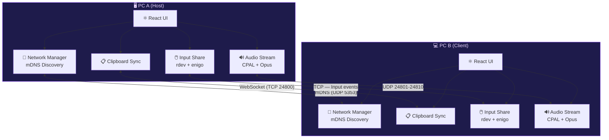

<div align="center">


# NetBridge · PC Conector

**Conecta tus PCs. Comparte sin límites.**
*Connect your PCs. Share without limits.*

[](LICENSE)
[](https://tauri.app)
[](https://www.rust-lang.org)
[](https://react.dev)
[](https://www.typescriptlang.org)

[](https://www.microsoft.com/windows)
[](https://kernel.org)
[](https://github.com/ChronosXCore/pc-conector)

---

**🌐 [Documentación](#-documentación) · 🚀 [Instalación](#-instalación) · ✨ [Características](#-características) · 🏗️ [Arquitectura](#-arquitectura) · 🤝 [Contribuir](CONTRIBUTING.md)**

</div>

---

## 🌟 ¿Qué es PC Conector?

**PC Conector** (también llamado **NetBridge**) es una aplicación de escritorio **moderna, ultraliviana y multiplataforma** que unifica tu flujo de trabajo conectando dos computadoras dentro de tu red local.

> *Think of it as having one keyboard, one mouse, one clipboard — for all your PCs.*

Construida con **Tauri 2 (Rust) + React 19 + TypeScript**, ofrece rendimiento nativo, diseño premium con glassmorphism y cero dependencia de servidores externos.

---

## ✨ Características

<table>
  <tr>
    <td align="center" width="200">
      <h3>🖱️ Mouse & Teclado</h3>
      <p>Desliza el cursor más allá del borde de tu pantalla y controla el otro PC sin interrupciones</p>
    </td>
    <td align="center" width="200">
      <h3>📋 Portapapeles</h3>
      <p>Copia texto en un PC y pégalo instantáneamente en el otro. Latencia &lt;200ms</p>
    </td>
    <td align="center" width="200">
      <h3>🔊 Audio en Vivo</h3>
      <p>Comparte micrófono o salida de audio entre dispositivos con bajísima latencia usando Opus</p>
    </td>
  </tr>
  <tr>
    <td align="center" width="200">
      <h3>📡 Auto-Descubrimiento</h3>
      <p>Detección automática de dispositivos en la red local via mDNS. Sin configuración manual de IPs</p>
    </td>
    <td align="center" width="200">
      <h3>🎯 Detección de Dispositivos</h3>
      <p>Clasificación automática: Celulares, Laptops, PCs, Impresoras, TVs, Routers con íconos premium</p>
    </td>
    <td align="center" width="200">
      <h3>📊 Monitor de Red</h3>
      <p>Gráfica de latencia en vivo, Hostname, IPs locales y métricas detalladas en tiempo real</p>
    </td>
  </tr>
  <tr>
    <td align="center" width="200">
      <h3>🌙 Tema Oscuro/Claro</h3>
      <p>Alternador rápido persistente con transiciones CSS fluidas. Glassmorphism y sombras neon</p>
    </td>
    <td align="center" width="200">
      <h3>🔒 Seguro</h3>
      <p>Comunicación cifrada SSL/TLS. Autenticación de dispositivos. Solo accesible en red local</p>
    </td>
    <td align="center" width="200">
      <h3>⚡ Ultraliviano</h3>
      <p>CPU &lt;5% en reposo, RAM &lt;200MB. Compilado en Rust nativo. Sin Electron</p>
    </td>
  </tr>
</table>

---

## 🏗️ Arquitectura

PC Conector sigue una arquitectura **peer-to-peer descentralizada**. Cada instancia actúa simultáneamente como servidor y cliente.



### Puertos utilizados

| Puerto | Protocolo | Servicio |
|:------:|:---------:|---------|
| `5353` | UDP | mDNS — Descubrimiento automático |
| `24800` | TCP/WS | WebSocket — Señalización y portapapeles |
| `24801–24810` | UDP | Streaming de audio (Opus) |

---

## 🛠️ Stack Tecnológico

| Capa | Tecnología | Propósito |
|------|-----------|-----------|
| **Frontend** |  | Interfaz de usuario moderna |
| **Lenguaje UI** |  | Tipado estático y DX superior |
| **Build Tool** |  | Dev server ultrarrápido |
| **Framework Desktop** |  | Shell nativo sin Electron |
| **Backend** |  | Rendimiento y seguridad nativa |
| **Audio** | `CPAL + Opus` | Captura y codec de baja latencia |
| **Input** | `rdev + enigo` | Captura y simulación de eventos |
| **Clipboard** | `arboard` | Portapapeles multiplataforma |
| **Red** | `mDNS + WebSocket + UDP` | Descubrimiento y comunicación P2P |
| **Estilo** | `CSS Puro` | Glassmorphism, neon, variables de tema |

---

## 📂 Estructura del Repositorio

```
📦 pc-conector/
├── 📁 pc-conector/          # Código fuente (Frontend React + Backend Rust/Tauri)
│   ├── 📁 src/              # Componentes React y lógica UI
│   ├── 📁 src-tauri/        # Backend Rust: módulos de red, audio, input
│   └── 📄 package.json      # Dependencias y scripts npm
│
├── 📁 para-linux/           # Instalación rápida en Linux
│   └── 📄 AGENTE_PROMPT.md  # Prompt para instalación autónoma con IA
│
├── 📁 docs/                 # Documentación detallada
│   ├── 📄 ARCHITECTURE.md   # Arquitectura del sistema
│   ├── 📄 TECH_STACK.md     # Stack tecnológico detallado
│   ├── 📄 PROGRESS.md       # Progreso del desarrollo
│   ├── 📄 VISION.md         # Visión y objetivos del proyecto
│   └── 📄 REQUIREMENTS.md   # Requisitos funcionales y técnicos
│
├── 📄 README.md             # Este archivo
├── 📄 CONTRIBUTING.md       # Guía para contribuidores
├── 📄 SECURITY.md           # Política de seguridad
├── 📄 LICENSE               # Licencia Apache 2.0
└── 🖼️ Logo.png              # Logotipo oficial
```

---

## 🚀 Instalación

### Prerrequisitos

- [Node.js](https://nodejs.org/) ≥ 18 (incluye `npm`)
- [Rust](https://rustup.rs/) ≥ 1.75 (instalado vía Rustup)

### 🪟 Windows (10/11)

```powershell
# 1. Clonar el repositorio
git clone https://github.com/ChronosXCore/pc-conector.git
cd pc-conector/pc-conector

# 2. Instalar dependencias frontend
npm install

# 3. Ejecutar en modo desarrollo
npm run tauri dev
```

> **Nota:** Si es la primera vez, Rust compilará las dependencias nativas (~5-10 min). Las ejecuciones siguientes son inmediatas.

### 🐧 Linux (Arch / Ubuntu / Fedora)

#### Arch Linux / CachyOS / Omarchy Linux

```bash
# Instalar dependencias del sistema
sudo pacman -S --needed base-devel nodejs npm webkit2gtk-4.1 libappindicator-gtk3 librsvg openssl

# Instalar Rust (si no lo tienes)
curl --proto '=https' --tlsv1.2 -sSf https://sh.rustup.rs | sh
source "$HOME/.cargo/env"

# Clonar y ejecutar
git clone https://github.com/ChronosXCore/pc-conector.git
cd pc-conector/pc-conector
npm install && npm run tauri dev
```

#### Ubuntu / Debian

```bash
sudo apt update && sudo apt install -y \
  build-essential curl libssl-dev \
  libwebkit2gtk-4.1-dev libgtk-3-dev \
  libappindicator3-dev librsvg2-dev patchelf \
  nodejs npm

curl --proto '=https' --tlsv1.2 -sSf https://sh.rustup.rs | sh
source "$HOME/.cargo/env"

git clone https://github.com/ChronosXCore/pc-conector.git
cd pc-conector/pc-conector && npm install && npm run tauri dev
```

---

## 🤖 Instalación con Agente de IA (Un Solo Paso)

¿Tienes un agente de IA en tu otro PC con Linux? Copia el contenido de [`para-linux/AGENTE_PROMPT.md`](para-linux/AGENTE_PROMPT.md) y pégalo en el chat del agente. Él se encargará de todo automáticamente:

1. ✅ Clonar el repositorio
2. ✅ Instalar dependencias nativas del sistema
3. ✅ Compilar el backend en Rust
4. ✅ Dejar la aplicación ejecutándose

---

## 📚 Documentación

| Documento | Descripción |
|-----------|-------------|
| [📐 Arquitectura](docs/ARCHITECTURE.md) | Diseño del sistema, módulos y flujo de conexión |
| [🛠️ Tech Stack](docs/TECH_STACK.md) | Todas las tecnologías y dependencias usadas |
| [📊 Progreso](docs/PROGRESS.md) | Estado actual y registro de cambios |
| [🔭 Visión](docs/VISION.md) | Objetivos, inspiración y principios de diseño |
| [📋 Requisitos](docs/REQUIREMENTS.md) | Requisitos funcionales y técnicos detallados |
| [🤝 Contribuir](CONTRIBUTING.md) | Cómo contribuir al proyecto |
| [🔐 Seguridad](SECURITY.md) | Política de reporte de vulnerabilidades |

---

## 📊 Estado del Proyecto

```
Fase 0: Planificación & Diseño       ████████████████████ 100%  ✅
Fase 1: Fundación (Tauri + Red)      ████████████████████ 100%  ✅
Fase 2: Portapapeles                 ████████████████████ 100%  ✅
Fase 3: Mouse & Teclado              ████████████████████ 100%  ✅
Fase 4: Audio                        ████████████████████ 100%  ✅
Fase 5: Diseño Premium & Pulido      ████████████████████ 100%  ✅
```

**🎉 PC Conector está completamente implementado y funcional.**

---

## 🤝 ¿Cómo Contribuir?

¡Las contribuciones son bienvenidas! Lee nuestra [guía de contribución](CONTRIBUTING.md) para empezar.

```bash
# Fork el repo, luego:
git checkout -b feature/mi-mejora
git commit -m "feat: descripción de mi mejora"
git push origin feature/mi-mejora
# Abre un Pull Request 🚀
```

Consulta los [issues abiertos](https://github.com/ChronosXCore/pc-conector/issues) para ver qué se puede mejorar.

---

## 📜 Licencia

Distribuido bajo la **Licencia Apache 2.0**. Ver [`LICENSE`](LICENSE) para más información.

*Distributed under the Apache 2.0 License. See [`LICENSE`](LICENSE) for more information.*

---

## 💡 Inspiración

PC Conector se inspira en proyectos open-source como:
- **[Input Leap](https://github.com/input-leap/input-leap)** / **Barrier** / **Synergy** — Compartir mouse y teclado
- **[KDE Connect](https://kdeconnect.kde.org/)** — Sincronización de portapapeles
- **[SonoBus](https://sonobus.net/)** — Streaming de audio de baja latencia
- **Microsoft Mouse Without Borders** — Experiencia de múltiples PCs

---

<div align="center">

**Hecho con ❤️ usando Rust 🦀 y React ⚛️**

*Si este proyecto te es útil, considera darle una ⭐ en GitHub*

[](https://github.com/ChronosXCore/pc-conector/stargazers)

</div>
