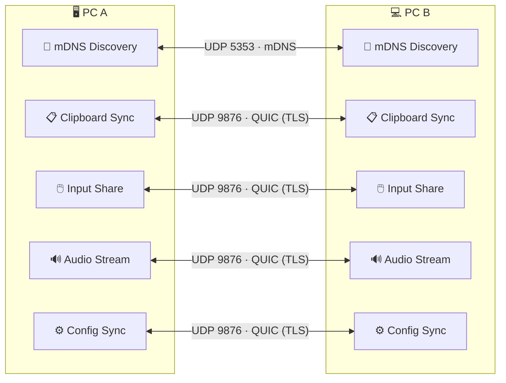
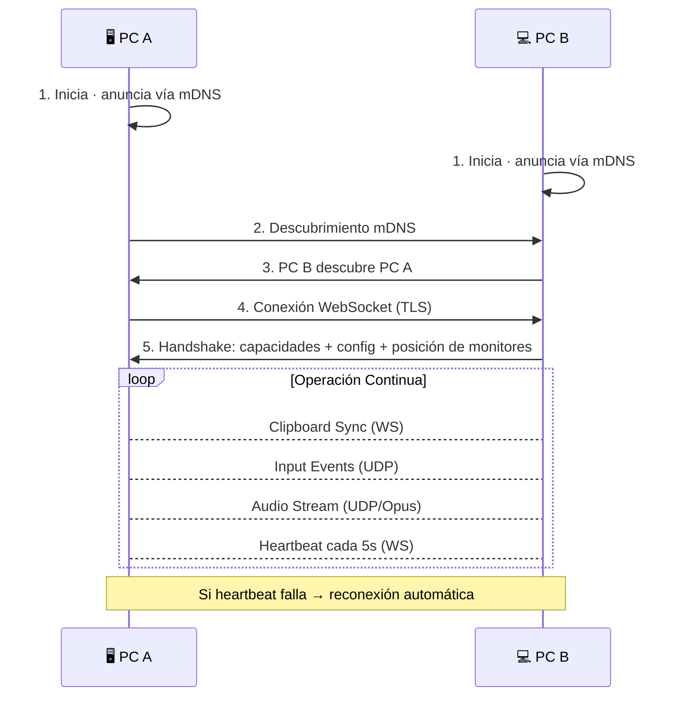

# 🏗️ PC Conector — Arquitectura del Sistema

---

## 📐 Visión General

PC Conector sigue una arquitectura **cliente-servidor descentralizada (peer-to-peer)**:

| Principio | Descripción |
|-----------|-------------|
| **Descentralizado** | Cada instancia actúa como servidor y cliente simultáneamente |
| **P2P Local** | Comunicación directa entre PCs, sin servidores intermediarios |
| **Sin Infraestructura** | No requiere cuentas, servidores cloud ni configuración de red manual |
| **Auto-descubrimiento** | Detección automática vía mDNS en la red local |

---

## 🗺️ Diagrama de Arquitectura

---

## 🧩 Módulos Principales

### 1. 📡 Network Manager
> **Responsabilidad**: Gestionar todas las conexiones de red

| Aspecto | Detalle |
|---------|---------|
| **Descubrimiento** | mDNS para detectar otros PCs con PC Conector en la LAN |
| **Conexión** | WebSocket seguro (TLS) para señalización y datos |
| **Heartbeat** | Cada 5 segundos para detectar desconexiones |
| **Reconexión** | Automática al perder conexión |

---

### 2. 📋 Clipboard Sync
> **Responsabilidad**: Sincronizar el portapapeles entre PCs en tiempo real

| Aspecto | Detalle |
|---------|---------|
| **Monitor** | Polling + eventos del sistema para detectar cambios |
| **Transmisión** | Envío inmediato a todos los peers conectados |
| **Recepción** | Actualización del portapapeles local con contenido remoto |
| **Latencia objetivo** | < 200ms |
| **Formatos** | Texto plano, imágenes, RTF |

---

### 3. 🖱️ Input Share (Mouse + Teclado)
> **Responsabilidad**: Compartir mouse y teclado entre PCs seamlessly

| Aspecto | Detalle |
|---------|---------|
| **Captura** | `rdev` para eventos globales del sistema |
| **Simulación** | `enigo` para reproducir eventos en la máquina remota |
| **Hot Corner** | Al llegar al borde de pantalla, el cursor se transfiere al otro PC |
| **Coordenadas** | Sistema de coordenadas virtual basado en grilla de monitores |
| **Clipboard Bridge** | Al transferir el cursor, el portapapeles se sincroniza automáticamente |
| **Latencia objetivo** | < 16ms (60fps) |

---

### 4. 🔊 Audio Stream
> **Responsabilidad**: Transmitir audio entre PCs en tiempo real con mínima latencia

| Aspecto | Detalle |
|---------|---------|
| **Captura** | `CPAL` para acceso a dispositivos de entrada/salida |
| **Codec** | Opus para compresión de audio optimizada para voz y música |
| **Transmisión** | UDP con secuenciación de paquetes |
| **Jitter Buffer** | Compensa variación de latencia de red |
| **Dispositivos** | Selección configurable por el usuario |
| **Latencia objetivo** | < 50ms |

---

### 5. ⚙️ Config Module
> **Responsabilidad**: Persistir y sincronizar configuración entre sesiones

**Almacenamiento**: JSON en el directorio de datos de la aplicación

**Contenido de la configuración**:
- 🖥️ Dispositivos de confianza (peer IDs + nombres)
- 📐 Posición de monitores en la grilla virtual
- 🔧 Funciones habilitadas/deshabilitadas
- 🔊 Preferencias de audio (dispositivos, calidad)
- 🚀 Auto-inicio con el sistema operativo
- 🌐 IP destino del ping de monitoreo

---

## 🔄 Flujo de Conexión

---

## 🔌 Puertos por Defecto

| Puerto | Protocolo | Servicio | Dirección |
|:------:|:---------:|---------|:---------:|
| `5353` | UDP | mDNS — Descubrimiento | Broadcast LAN |
| `9876` | UDP | QUIC — Conexión principal cifrada (TLS) | Bidireccional |

---

## 📚 Más Documentación

| Documento | Descripción |
|-----------|-------------|
| [🛠️ Tech Stack](TECH_STACK.md) | Tecnologías y dependencias detalladas |
| [📊 Progreso](PROGRESS.md) | Estado del desarrollo |
| [🔭 Visión](VISION.md) | Objetivos del proyecto |
| [📋 Requisitos](REQUIREMENTS.md) | Requisitos funcionales y técnicos |

---

[← Volver al README](../README.md)

