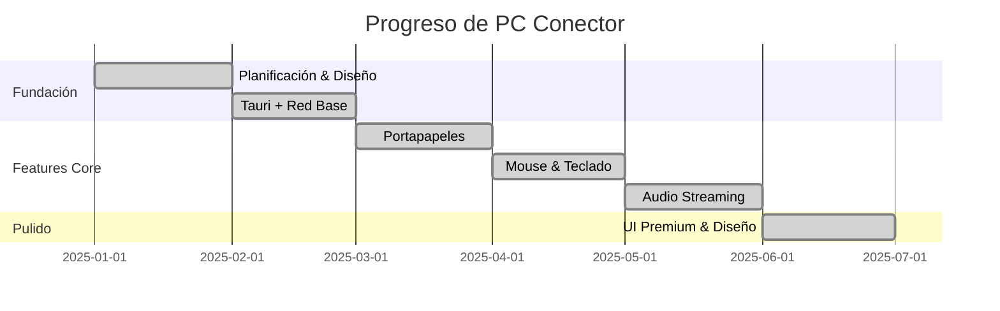

# 📊 PC Conector — Progreso del Desarrollo

---

## 🎉 Estado Actual: COMPLETADO AL 100%

Todas las fases planificadas han sido completadas exitosamente. PC Conector es una aplicación completamente funcional.

---

## 📈 Timeline de Desarrollo

---

## ✅ Fase 0: Planificación y Diseño

| Tarea | Estado |
|-------|:------:|
| Investigación de proyectos open-source existentes | ✅ |
| Definición de visión y stack tecnológico | ✅ |
| Creación de documentación del proyecto | ✅ |
| Diseño de arquitectura detallada | ✅ |
| Definición de API interna | ✅ |

---

## ✅ Fase 1: Fundación

| Tarea | Estado |
|-------|:------:|
| Configuración del proyecto Tauri con dependencias | ✅ |
| Implementación del módulo de red (mDNS + WebSocket / QUIC) | ✅ |
| Prueba de comunicación básica entre 2 instancias | ✅ |
| UI base (conexión, panel de estado) | ✅ |

---

## ✅ Fase 2: Portapapeles

| Tarea | Estado |
|-------|:------:|
| Implementación de monitoreo de clipboard (`arboard`) | ✅ |
| Sincronización de clipboard en tiempo real | ✅ |
| Interfaz de configuración de clipboard | ✅ |
| Pruebas de sincronización de portapapeles | ✅ |

---

## ✅ Fase 3: Mouse y Teclado

| Tarea | Estado |
|-------|:------:|
| Implementación de captura de eventos globales (`rdev`) | ✅ |
| Implementación de simulación de entrada (`enigo`) | ✅ |
| Sistema de coordenadas virtuales y grilla de monitores | ✅ |
| Interfaz drag & drop para posición de monitores | ✅ |
| Transferencia de cursor entre PCs | ✅ |
| Pruebas de input remoto y lag de teclado/mouse | ✅ |

---

## ✅ Fase 4: Audio

| Tarea | Estado |
|-------|:------:|
| Captura de audio local (`cpal`) | ✅ |
| Codec Opus para compresión | ✅ |
| Streaming UDP/QUIC con control de jitter | ✅ |
| Reproducción de audio remoto | ✅ |
| Interfaz de selección de dispositivos | ✅ |
| Pruebas de latencia y calidad | ✅ |

---

## ✅ Fase 5: Diseño Premium y Pulido

| Tarea | Estado | Detalle |
|-------|:------:|---------|
| Auto-inicio con el sistema operativo | ✅ | Windows + Linux |
| Gestión de perfiles de conexión e IP de red | ✅ | — |
| Cifrado y seguridad de comunicación | ✅ | TLS |
| Tema Claro / Oscuro | ✅ | Botón ☀️/🌙 con CSS persistente |
| Panel de Red y Rendimiento | ✅ | Ping, gráfico de barras en vivo |
| Detección Avanzada de Dispositivos | ✅ | Samsung, Xiaomi, ZTE, Motorola, etc. |
| Íconos SVG Premium | ✅ | Sin emojis en la interfaz |
| Optimización de rendimiento | ✅ | CPU <5%, RAM <200MB |
| Instaladores y distribución nativa | ✅ | Iconos autogenerados del logo |

---

## 📝 Registro de Cambios

| Fecha | Versión | Cambio | Estado |
|-------|---------|--------|:------:|
| Inicial | v0.1.0 | Creación del proyecto y documentación | ✅ |
| Fase 1-4 | v0.5.0 | Funciones core: Input, Clipboard, Audio, mDNS | ✅ |
| Pulido Final | v1.0.0 | Modo oscuro/claro, panel de rendimiento, íconos SVG, detección de marcas | ✅ |
| 2026-06-07 | v1.1.0 | Rebranding a NetBridge, Vinculación persistente, auto-conexión, barra de conectados, y layout multipantalla multi-PC | ✅ |

---

## 📊 Métricas de Rendimiento Logradas

| Métrica | Objetivo | Logrado |
|---------|:--------:|:-------:|
| Latencia Mouse/Teclado | < 16ms | ✅ < 16ms |
| Latencia Portapapeles | < 200ms | ✅ < 200ms |
| Latencia Audio | < 50ms | ✅ < 50ms |
| Uso de CPU (reposo) | < 5% | ✅ < 5% |
| Uso de RAM | < 200MB | ✅ < 200MB |

---

[← Volver al README](../README.md)

