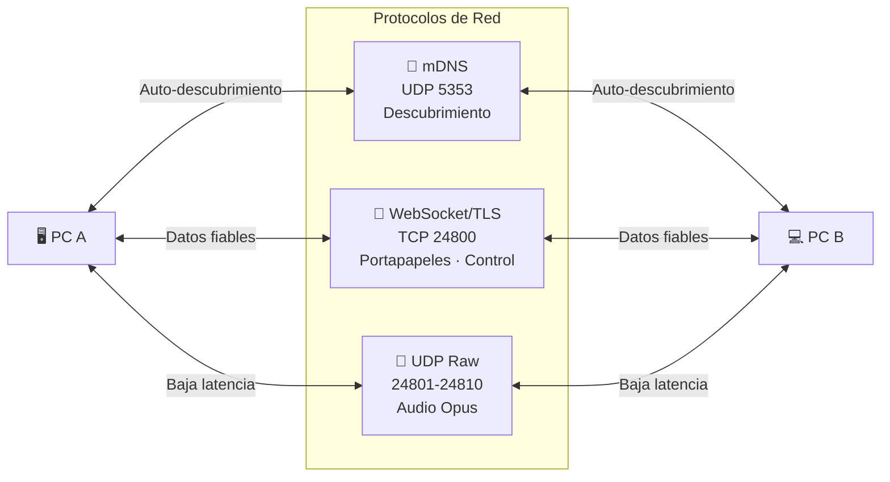

<div align="center">

# 🛠️ PC Conector — Stack Tecnológico Detallado

[](../README.md)

</div>

---

## 🎨 Frontend

### Tecnologías Principales

| Tecnología | Versión | Propósito |
|-----------|:-------:|-----------|
|  | ^19 | Framework de UI |
|  | ~6.0 | Tipado estático y DX superior |
|  | ^8.0 | Build tool / Dev server ultrarrápido |
| **CSS Puro** | — | Glassmorphism, animaciones, temas |

### Dependencias Frontend

| Paquete | Propósito |
|---------|-----------|
| `@tauri-apps/api` | Comunicación bidireccional con el backend Rust |
| `react-router-dom` | Navegación entre vistas de la app |
| `zustand` | Estado global reactivo (configuración de usuario) |
| `@dnd-kit/core` | Drag & drop para posicionamiento visual de monitores |

---

## 🦀 Backend (Rust / Tauri v2)

### Framework y Runtime

| Crate | Versión | Propósito |
|-------|:-------:|-----------|
| `tauri` | 2.11 | Framework de escritorio multiplataforma |
| `tokio` | latest | Runtime asíncrono de alta performance |
| `serde` / `serde_json` | latest | Serialización/deserialización de datos |
| `tracing` | latest | Logging estructurado y depuración |

### Módulos Funcionales

| Crate | Módulo | Propósito |
|-------|--------|-----------|
| `arboard` | Portapapeles | Acceso multiplataforma al portapapeles del sistema |
| `enigo` | Input Share | Simulación de eventos de mouse y teclado |
| `rdev` | Input Share | Captura de eventos globales del sistema |
| `cpal` | Audio | Captura y reproducción de audio (plataforma-nativo) |
| `symphonia` | Audio | Decodificación y streaming de audio |
| `mdns-sd` | Red | Descubrimiento automático vía mDNS/Zeroconf |
| `tokio-tungstenite` | Red | WebSockets para comunicación en tiempo real |

---

## 🌐 Protocolos de Comunicación



| Protocolo | Puerto | Uso | Por qué |
|-----------|:------:|-----|---------|
| mDNS (RFC 6762) | 5353 | Descubrimiento automático en LAN | Sin configuración manual de IP |
| WebSocket (TLS) | 24800 | Señalización, comandos, portapapeles | Confiable, full-duplex, seguro |
| UDP | 24801-24810 | Streaming de audio | Baja latencia, no importa pérdida mínima |

---

## 🖥️ Plataformas Objetivo

| Plataforma | Soporte | Notas |
|-----------|:-------:|-------|
|  | ✅ Completo | Probado en Windows 10 y 11 |
|  | ✅ Completo | Incluye soporte para WinUI |
|  | ✅ Completo | Omarchy Linux / CachyOS / Arch |
|  | ✅ Compatible | Ubuntu 22.04+ |
|  | ✅ Compatible | Fedora 38+ |

---

## 📐 Diagrama de Capas

```
┌──────────────────────────────────────────────────────────┐
│                     PC Conector                          │
│                                                          │
│  ┌────────────────────────────────────────────────────┐  │
│  │           🎨 Frontend (React + Vite)               │  │
│  │  ┌──────────┐ ┌──────────┐ ┌──────────────────┐   │  │
│  │  │  Config   │ │  Status  │ │   Monitor Grid   │   │  │
│  │  │   Panel   │ │  Panel   │ │  (Drag & Drop)   │   │  │
│  │  └──────────┘ └──────────┘ └──────────────────┘   │  │
│  └─────────────────────┬──────────────────────────────┘  │
│                        │ Tauri IPC                        │
│  ┌─────────────────────▼──────────────────────────────┐  │
│  │              🦀 Backend (Rust / Tauri 2)           │  │
│  │  ┌──────────┐ ┌──────────┐ ┌────────┐ ┌────────┐  │  │
│  │  │ Network  │ │Clipboard │ │ Input  │ │ Audio  │  │  │
│  │  │ Manager  │ │  Sync    │ │ Share  │ │ Stream │  │  │
│  │  │ (mDNS+WS)│ │(arboard) │ │rdev+en │ │cpal+Op │  │  │
│  │  └──────────┘ └──────────┘ └────────┘ └────────┘  │  │
│  └────────────────────────────────────────────────────┘  │
└──────────────────────────────────────────────────────────┘
```

---

<div align="center">

[← Volver al README](../README.md) · [Arquitectura →](ARCHITECTURE.md)

</div>
