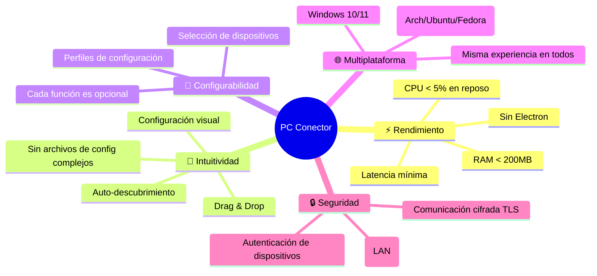

<div align="center">

# 🔭 PC Conector — Visión del Proyecto

[](../README.md)

> *"One workspace. Two computers. Zero friction."*

</div>

---

## 🌟 ¿Qué es PC Conector?

**PC Conector** es una aplicación de escritorio **gratuita, open-source y multiplataforma** que elimina la fricción de trabajar con múltiples computadoras. Conecta dos PCs a través de la red local (WiFi/Ethernet) para compartir recursos de forma transparente.

Es como tener **un solo teclado, un solo mouse y un solo portapapeles** para todos tus equipos.

---

## 🎯 Problema que Resuelve

Los usuarios con múltiples PCs enfrentan estos problemas a diario:

```
❌ Cambiar físicamente de teclado y mouse entre equipos
❌ Transferir texto/archivos via USB, correo o cloud
❌ Configurar audio de forma separada en cada equipo
❌ Interrumpir el flujo de trabajo al cambiar de PC
```

**PC Conector los elimina todos:**

```
✅ Desliza el cursor al borde de la pantalla → continúa en el otro PC
✅ Copia en un PC → pega en el otro instantáneamente
✅ Audio bidireccional con latencia < 50ms
✅ Configuración visual con drag & drop
```

---

## 🚀 Capacidades Clave

| Función | Estado | Latencia |
|---------|:------:|:--------:|
| 🖱️ Compartir Mouse | ✅ Completo | < 16ms |
| ⌨️ Compartir Teclado | ✅ Completo | < 16ms |
| 📋 Portapapeles | ✅ Completo | < 200ms |
| 🔊 Streaming de Audio | ✅ Completo | < 50ms |
| 📡 Auto-descubrimiento | ✅ Completo | Instantáneo |
| 🔒 Cifrado TLS | ✅ Completo | — |
| 🌙 Tema Oscuro/Claro | ✅ Completo | — |
| 📊 Monitor de Red | ✅ Completo | — |

---

## 💡 Inspiración

PC Conector combina lo mejor de varios proyectos open-source existentes:

| Proyecto | Inspiración |
|----------|-------------|
| [Input Leap](https://github.com/input-leap/input-leap) / Barrier / Synergy | Compartir mouse y teclado |
| [KDE Connect](https://kdeconnect.kde.org/) | Sincronización de portapapeles |
| [SonoBus](https://sonobus.net/) | Streaming de audio de baja latencia |
| Microsoft Mouse Without Borders | Experiencia fluida de múltiples PCs |

---

## 👥 Público Objetivo

- 💻 **Desarrolladores** que trabajan con múltiples equipos (PC + laptop, Windows + Linux)
- 🎮 **Gamers** con setup multi-PC
- 🏠 **Usuarios domésticos** con PC de escritorio + laptop
- 🐧 **Entusiastas de Linux** (especialmente Omarchy Linux) que buscan alternativas open-source
- 🏢 **Profesionales** en home office o entornos de trabajo híbridos

---

## 🏗️ Principios de Diseño



---

## 🗺️ Roadmap Futuro

> Las siguientes mejoras están planeadas pero no implementadas aún.

| Función | Prioridad |
|---------|:---------:|
| Transferencia de archivos drag & drop entre PCs | 🟡 Media |
| Soporte para macOS | 🟢 Baja |
| Sincronización de imágenes en portapapeles | 🟡 Media |
| Grilla de más de 2 monitores virtuales | 🟡 Media |
| Modo de conexión por Internet (WAN con relay) | 🔴 Baja |
| Plugin para compartir pantalla | 🟢 Baja |

---

<div align="center">

[← Volver al README](../README.md) · [Arquitectura →](ARCHITECTURE.md)

</div>
